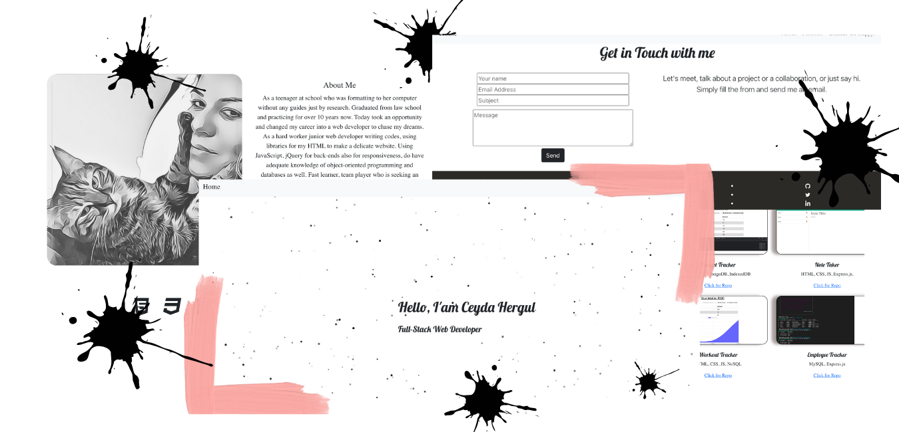

  

 

# My React Portfolio

Welcome to React-Portfolio page. 

You can clone this repo.

git clone https://github.com/chergul/React-Portfolio.git

## Table of Contents
* [How to Use](#how-to-use)
* [Heroku Deployment](#heroku-deployment)
* [Video for the app](#video-for-the-app)
* [For the future](#for-the-future)
* [Questions](#questions)

## How to Use

Change general.js file to get your Personal Porfolio.

## Heroku Deployment

https://nameless-basin-56340.herokuapp.com

## Video for the app
​

## For the future

- Make it more interactive
- Add .env for the email.js
- Add more sections

## Questions
If you have any questions about this repo, you can open an issue, or contact directly at 
ceyda_hergul@hotmail.com
Pull requests are welcome